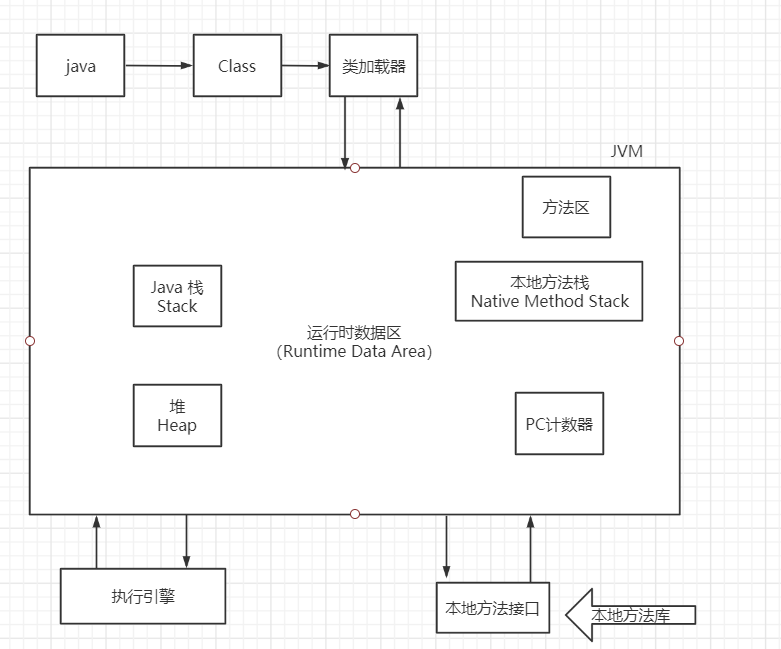
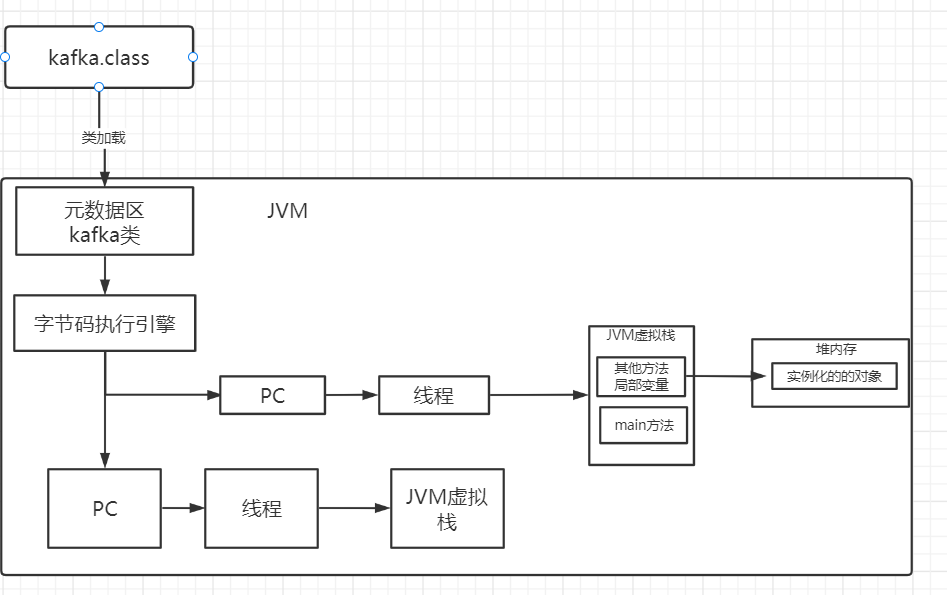
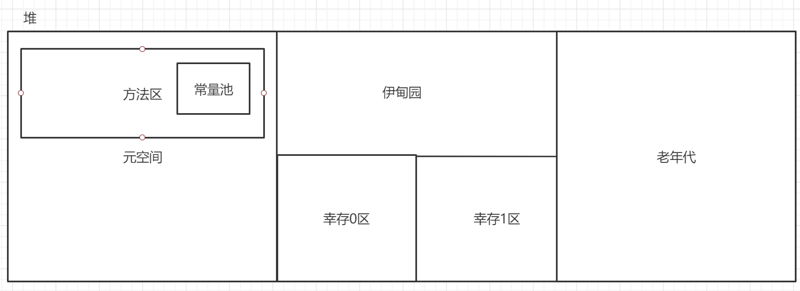

# 前言

.java文件打包成jar包经过编译变成.class文件。

.class文件运行在JVM上，通过类加载器把编译好的“.class"字节码文件加载到JVM中。之后JVM会基于自己的字节码执行引擎，执行加载到内存里的写好的那些类了。

类加载器加载类的过程：

加载—>验证—>准备—>解析—>初始化

加载：将.class加载到JVM

验证：检查.class语法是否有问题

准备：分配空间，赋值变量为0

解析：解析.class字节码

初始化：根据程序的初始化对相应的变量进行赋值

# JVM位置

​	运行在操作系统之上

# JVM体系结构



# 类加载器

加载Class文件

加载器：

1. 虚拟机自带的加载器
2. 启动类加载器
3. 扩展类加载器
4. 应用程序加载器
5. 自定义的加载器

# 双亲委派机制

App-->Ext-->Boot（最终执行）

​	当需要加载一个类时，向上委托父类加载器能否完成，能则由父类加载，不能则检查自身加载器能否完成，能则加载，不能则抛出异常。

执行步骤：

1. 类加载器收到类加载的请求
2. 将请求向上委托给父类加载器完成，一直向上委托，直到启动类加载器
3. 启动加载器检查是否能够加载当前这个类，能加载就结束并使用，不能抛出异常
4. 重复步骤三

# JVM运行原理



# 沙箱安全机制

# Native

```java
public class Demo{

​	private native void start();

}
```

java native interface

native:凡是带了native关键字的，说明Java的作用范围达不到了，会去调用底层C语言的库

进入本地方法栈

会调用本地方法本地接口， JNI

JNI作用：扩展Java的使用，融合不同的编程语言。

在最终执行的时候，通过JNI加载本地方法库中的方法

# PC寄存器

每个线程都有一个PC，线程私有，存储指向将要执行的指令的代码的地址，即指向方法区中的方法，在执行引擎中读取下一条指令。

# 方法区

被所有线程共享

- 静态变量、常量、类信息（构造方法、接口定义）、运行时的常量池存在方法区中，但是实例变量存在堆内存中，和方法区无关。

# 栈

具体存放的东西，怎么存？

对象在内存中实例化的过程

# 三种JVM

# 堆



堆内存默认情况下：分配的总内存是电脑内存的1/4，而初始化的内存是1/64

# 新生区

类：诞生和成长的地方

# 老年区

# 永久区（元空间）

这个区域常驻内存，用来存放jdk自身携带的class对象，Interface元数据，存储的是Java运行时的一些环境或类信息，这个区域不存在垃圾回收，关闭Vmware虚拟机就会释放这个区域的内存。

一个启动类，加载了大量的第三方jar包，tomcat部署了太多的应用，大量动态生成的反射类，不断地被

逻辑上存在，物理上不存在。

# Jprofiler

- 分析dump文件

  -Xms1m -Xmx8m -XX:+HeapDumpOnOutOfMemoryError

# 堆内存调优

OOM：out of memory

解决：

1. 扩大堆内存。

   -Xms1024m -Xmx1024m -XX:+PrintGCDetails

2. 分析代码，哪里出现了问题。

# GC

# JMM

java memory model

1. 什么是JMM

2. 它是干什么的

   线程工作内存与主内存之间的抽象关系，线程之间的共享变量存储在主内存中，每个线程都有一个私有的本地内存。

   解决共享对象的可见性的问题：volatile。保证可见性

3. 它的规则

   

   