# 过程

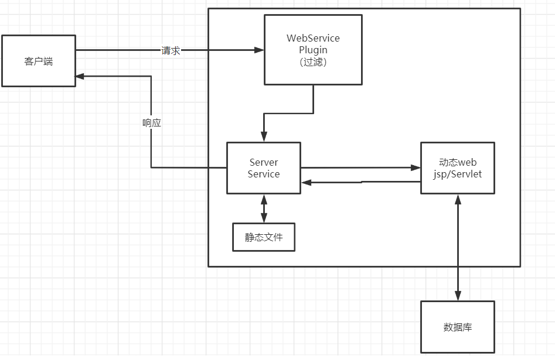

# web服务器

处理用户请求以及进行响应

语言：

## ASP

## PHP

## JSP/Servlet

B/S:浏览器/服务器

C/S:客户端/服务器

## Tomcat(web服务器)

如果总是错误，降低版本

- 用来响应HTML页面的访问请求

- apache-->conf-->server.xml：服务器核心配置文件。可以用来配置端口号、主机名称之类的

- 可以将自己写的网站放到Tomcat指定的web应用的文件夹webapps下，即可访问。
  -  WEB-INF放置网站程序

- 网站的访问过程？

1.先在本机上找，没有的话去DNS服务器找，找到就返回，找不到就返回找不到、

# HTTP

Hypertex Transfer Protocol:超文本协议

是一个简单的请求-响应协议，它通常运行在[TCP](https://baike.baidu.com/item/TCP/33012)之上

## 两个时代

1.0：客户端与web服务器连接后只能获得一个web资源，断开连接

1.1：客户端与web服务器连接后可以获得多个web资源

## HTTP请求

### 1、请求行

请求方式：Get，Post

- get:携带参数少，在url中显示，不安全
- post:携带参数多，不在url中显示，安全

### 2、消息头

```
Accept:text/html	告诉浏览器支持的数据类型
Accept-Encoding:gzip,deflate,br 支持哪种编码格式
Accept-Language:zh-CN,zh:q=0.9 告诉浏览器，语言环境
Cache-Control:max-age=0 缓存控制
Connection:keep-alive 告诉浏览器，请求完成时断开还是保持连接
HOST: 主机
```


## HTTP响应

### 1、响应体

```
Accept:text/html	告诉浏览器支持的数据类型
Accept-Encoding:gzip,deflate,br 支持哪种编码格式
Accept-Language:zh-CN,zh:q=0.9 告诉浏览器，语言环境
Cache-Control:max-age=0 缓存控制
Connection:keep-alive 告诉浏览器，请求完成时断开还是保持连接
HOST: 主机
Refresh:告诉浏览器，多久刷新一次；
Location：让网页重新定位
```

### 2、响应状态码

200：请求响应成功

3**：请求重定向

404：找不到资源

5xx：服务器代码错误

# Maven

## 功能

自动导入和配置jar包

架构管理

# Servlet

## 1、HelloServlet

quikStart去官网找

## 2、Servlet映射Mapping

我们写的是Java程序，需要通过浏览器访问，而浏览器要连接web服务器，所以我们需要web服务器中注册我们写的Servlet，还需给他一个浏览器能够访问的路径

web.xml文件中部署

```xml
<web-app>  
    
    <servlet>
        <servlet-name>HelloWorld</servlet-name>  3.servlet-name相匹配
        <servlet-class>HelloWorld</servlet-class>	4得到class文件
    </servlet>
    
    <servlet-mapping>
        <servlet-name>HelloWorld</servlet-name>		2.根据url得到servlet-name
        <url-pattern>/HelloWorld</url-pattern> 			1.对应url
    </servlet-mapping>
    
</web-app>
```

```xml
Web.xml是用来配置参数的
与数据的连接也是在这里配置
<context-param>
	<param-name>key</param-name>
	<param-value>jdbc:mysql://localhost:3306/mybatis</param-value>
</context-param>
```


## 3、Servlet原理

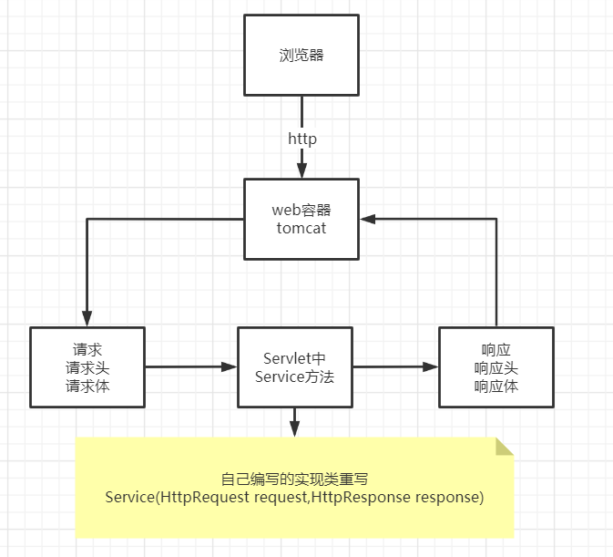

## 4、ServletContext

web容器(tomcat）会为每一个启动的Web程序创建一个ServletContext，代表当前web应用。

- 共享数据

  ```java
  ServletContext servletContext = this.getServletContext();
  在一个Servlet中使用
  servletContext.addAAttribute("key","value")；存储起来
  在另一个Servlet中使用
  servletContext.getAttribute("key");得到value
  ```

- 获取初始化参数

  ```java
  servletContext.getInitParameter("key");
  ```

- 请求转发

  ```java
  servletContext.getRequestDispatcher("/url").forward(req,resp);
  路径不变，页面变化
  ```

- 获取资源文件

  ```java
  servletContext.getResourceAsStream("/WEB_INF/classes/*.propertires"); 
  返回InputStream类型，是一个流，如果想读取，可以：
  Properties pro = new Properties();
  pro.load(inputStream);
  pro.getProperty("key");配置文件中配置
  ```

  

## 5、HttpServletResponse

获取客户端请求的参数找：HttpServletRequest

给客户端响应性信息：HttpServletResponse

### 1、简单应用

- 向浏览器发送数据的方法

  ```java
  ServletOutputStream getOutputStream() throws IOException;
  PrintWriter getWriter() throws IOException;
  ```

- 像浏览器发送响应头的方法

  ```java
  ...
  ```

  

### 2、下载文件

- 获取下载路径
- 下载文件名？
- 想办法
- 获取下载文件的的输入流
- 创建缓冲区
- 获取OutputStream对象
- 将FileOutputStream写入buffer缓冲区
- 使用OutputStream将缓冲区的数据输出到客户端

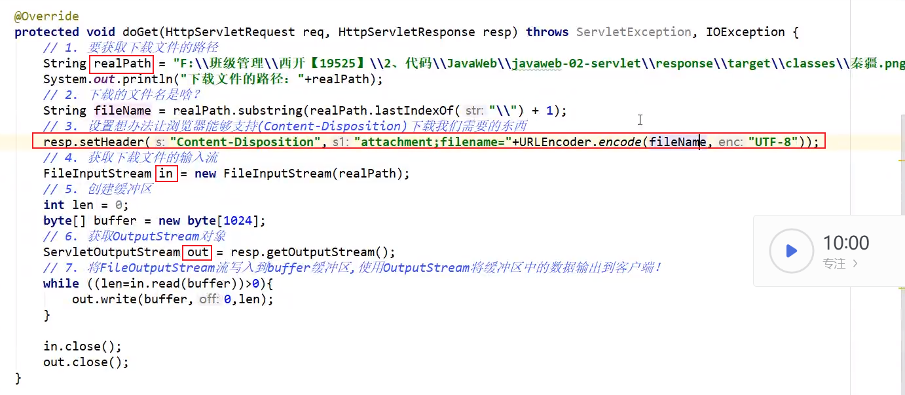

写完后记得去web.xml中进行Servlet映射

### 3、验证码功能

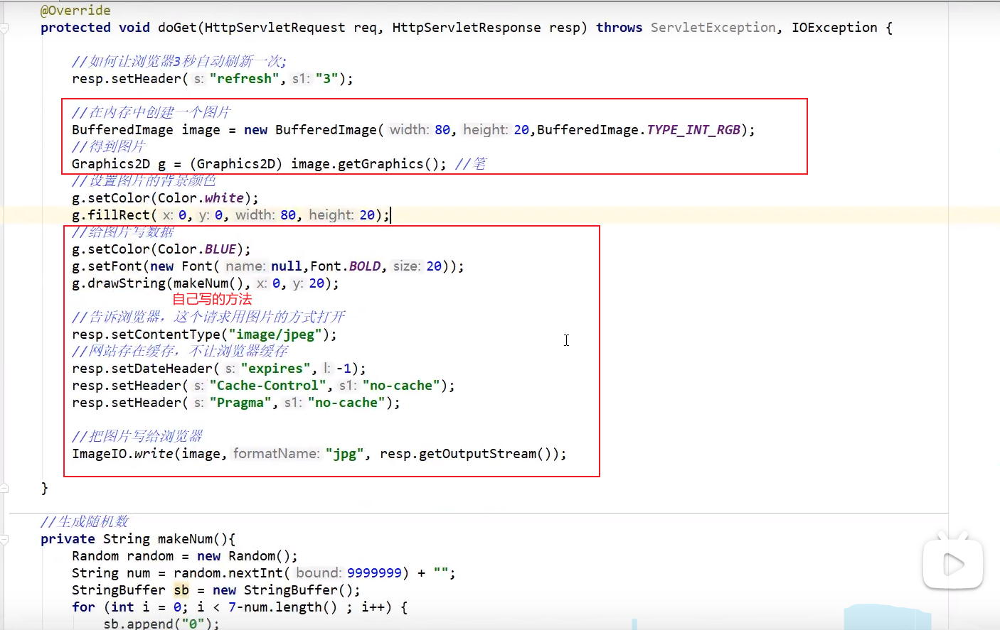

### 4、重定向

```
resp.sendRedirect("url");
```

重定向和转发的区别：

相同点：页面跳转

不同点：url是否变化

### 5、提交并处理表单数据

```java
进入到index页面。
index.jsp中有一个form表单,action="url"。
"url"，代表当提交表单时，表单数据会提交到名为 "url" 的页面。
在web.xml中配置servlet.与RequestTest类对应。
在RequestTest中处理得到的数据。
req.getParameter("key");
```

## 6、HttpServletRequest

### 1、获取前端传递的参数

```
req.getParameter("key");
```

### 2、请求转发

```java
req.getRequestDispatcher("url").forward(req,resp);
eg:
url=/success.jsp
success.jsp是在webapp文件目录下，与WEB-INF同目录
```

# Cookie

cookie：客户端携带数据到网站

session：会话，网站服务器存储信息和数据，识别客户

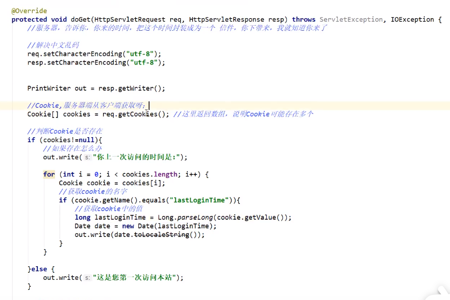

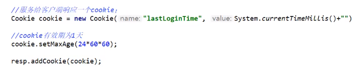

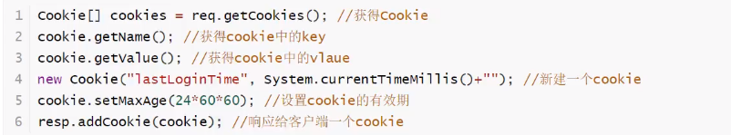

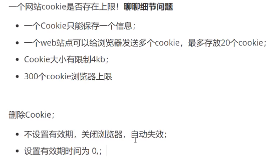

## 中文数据传递

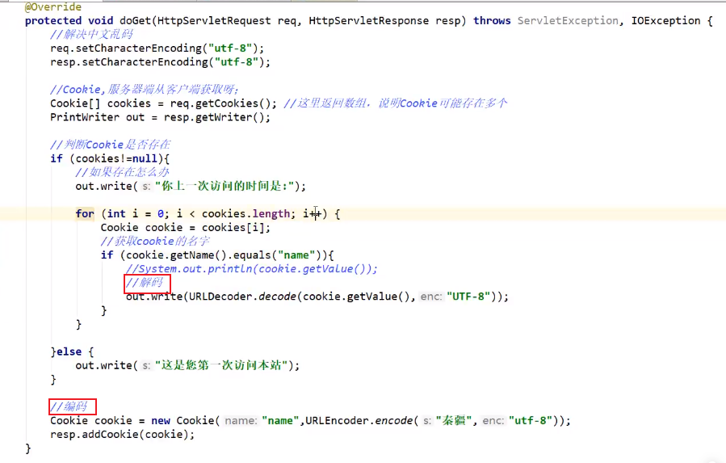

# Session(重点)

- 服务器给每一个客户创建一个Session对象
- 一个Session独占一个浏览器
- 保存用户的信息

步骤：

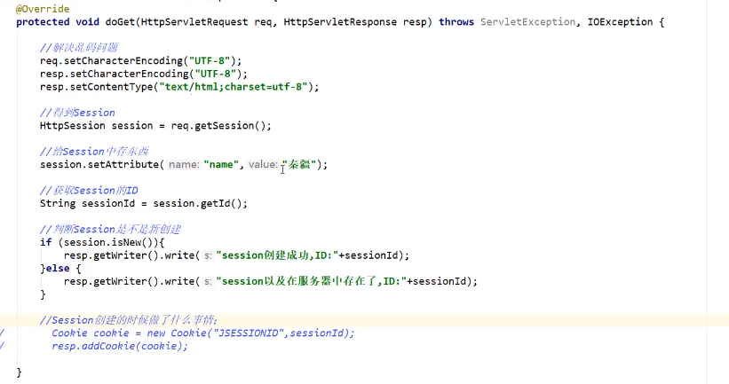

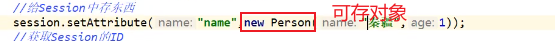

得到的对象也就成为了Person

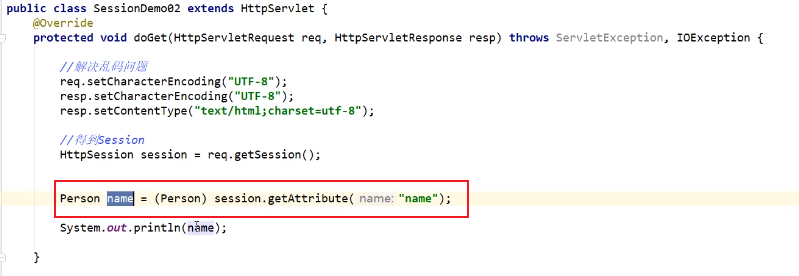

注销

手动注销：

```java
HttpSession session = req.getSession();
session.removeAttribute("key");
session.invalidate();//手动注销
```

在web.xml中设置自动注销

```xml
<session-config>
	<session-timeout>1</session-timeout>
</session-config>
```

## Session 和Cookie的区别

- Cookie是把把用户的数据写给用户的浏览器，浏览器保存

- Session时把用户的数据写到服务器中，服务器端保存

- Session对象由服务器创建

# MVC

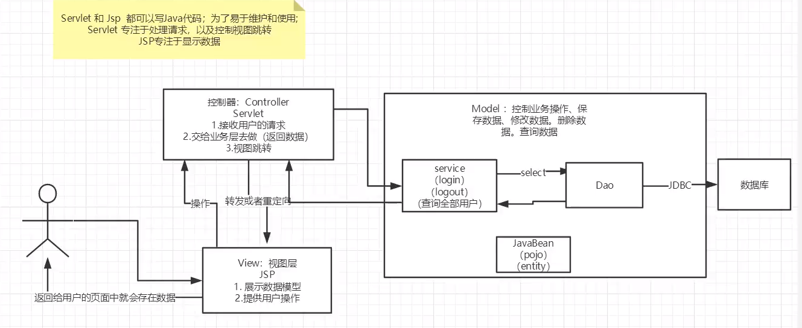

Model

- 业务处理

- 数据持久层Dao

View

- 展示数据
- 提供链接发起Servlet请求(a,form,img)

Controller(Servlet)

- 接受用户的请求
- 交给业务层处理对应的代码
- 控制视图的跳转
