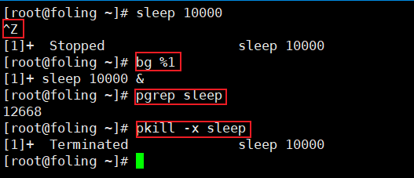

Exercises

1. From what we have seen, we can use some `ps aux | grep` commands to get our jobs’ pids and then kill them, but there are better ways to do it. Start a `sleep 10000` job in a terminal, background it with `Ctrl-Z` and continue its execution with `bg`. Now use [`pgrep`](https://www.man7.org/linux/man-pages/man1/pgrep.1.html) to find its pid and [`pkill`](http://man7.org/linux/man-pages/man1/pgrep.1.html) to kill it without ever typing the pid itself. (Hint: use the `-af` flags).

   

